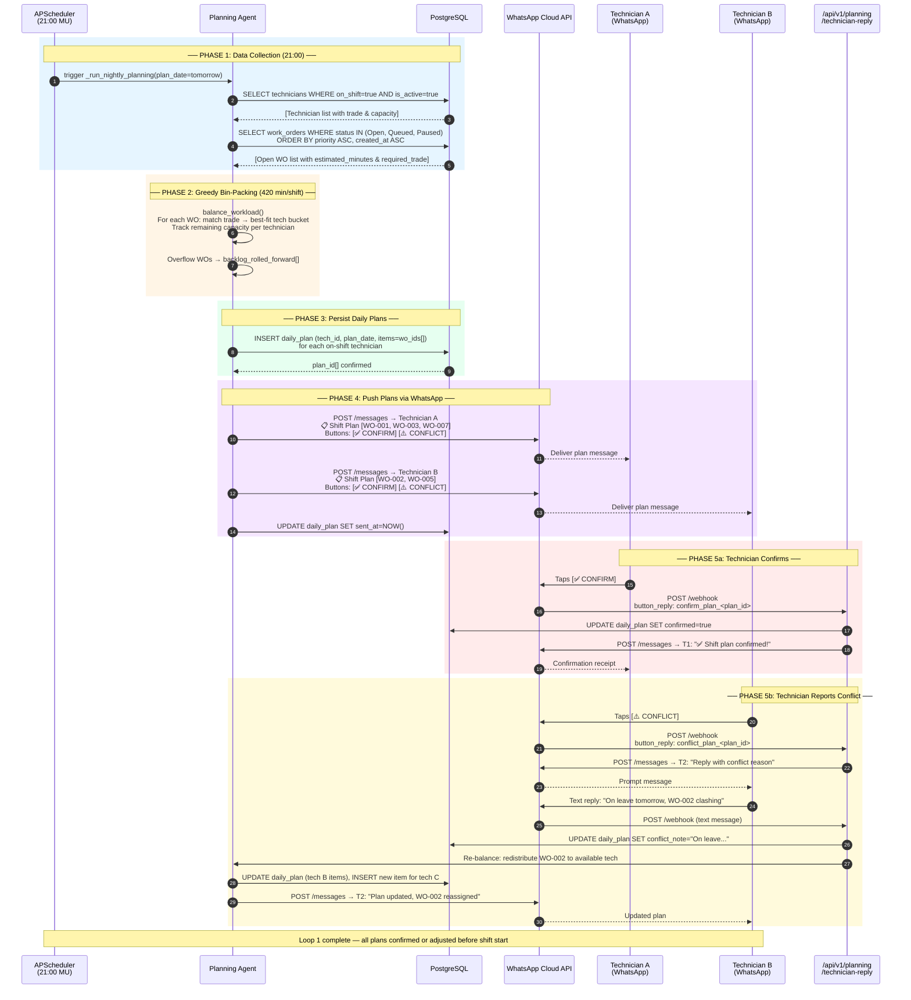

# RT Knits Agentic CMMS — Sequence Diagrams

---

## Diagram 1 — Loop 1: Nightly Batch Planning & Technician Conflict Resolution

---

## Diagram 2 — Loop 2: Live Triage, Rating Gate, P0 Preemption & Async Escalation

```mermaid
sequenceDiagram
    autonumber

    participant REQ   as Requester<br/>(WhatsApp)
    participant META  as Meta Cloud API
    participant WH    as POST /webhook<br/>(FastAPI)
    participant ORCH  as Orchestrator<br/>(LangGraph)
    participant RG    as Rating Gate<br/>Service
    participant DB    as PostgreSQL
    participant IA    as Intake Agent<br/>(GPT-4o + Whisper)
    participant KA    as Knowledge Agent<br/>(ChromaDB)
    participant TA    as Triage Agent
    participant DA    as Dispatch Agent
    participant ESC   as P0 Escalation<br/>(APScheduler)
    participant TECH  as Technician<br/>(WhatsApp)

    rect rgb(240, 240, 255)
        Note over REQ,WH: ── INBOUND MESSAGE ──
        REQ->>META: WhatsApp message<br/>(text / voice note / photo)
        META->>WH: POST /webhook (HMAC-signed payload)
        WH->>WH: Verify X-Hub-Signature-256<br/>Deduplicate message_id
        WH->>META: Mark message as READ (double blue tick)
    end

    rect rgb(255, 245, 220)
        Note over WH,RG: ── RATING GATE CHECK ──
        WH->>ORCH: invoke(OrchestratorState)
        ORCH->>RG: check_rating_gate(requester_id, db)
        RG->>DB: SELECT wo_id FROM work_order<br/>JOIN task_request WHERE status=Completed<br/>LEFT JOIN feedback WHERE feedback IS NULL
        DB-->>RG: [pending_wo_ids] or []

        alt Requester has unrated completed WOs
            RG-->>ORCH: RatingGateBlock(blocked=True, pending=[WO-X])
            ORCH->>META: POST /messages → REQ<br/>⭐ "Rate WO-X before submitting new request"
            META-->>REQ: Blocking message
            Note over REQ,META: ── Requester submits rating reply ──
            REQ->>META: "WO-X 4"
            META->>WH: POST /webhook
            WH->>DB: INSERT feedback(wo_id, rating=4)
            WH->>DB: UPDATE technician SET reward_score += delta
            WH->>META: POST /messages → REQ: "⭐⭐⭐⭐ Recorded!"
        else No pending ratings
            RG-->>ORCH: RatingGateBlock(blocked=False)
        end
    end

    rect rgb(230, 255, 240)
        Note over ORCH,IA: ── INTAKE AGENT ──
        ORCH->>IA: IntakeInput(raw_text, image_id?, audio_id?)

        opt Voice note detected
            IA->>META: GET /<media_id> (download audio)
            META-->>IA: audio bytes (.ogg)
            IA->>IA: Whisper API → transcript
        end

        opt Photo detected
            IA->>META: GET /<media_id> (download image)
            META-->>IA: image bytes
            IA->>IA: GPT-4o Vision → fault description
        end

        IA->>IA: GPT-4o: translate + extract FaultDetail<br/>(asset_name, fault_description, urgency_signal)

        alt Missing required details
            IA-->>ORCH: IntakeOutput(is_complete=False,<br/>clarification_needed="Which machine?")
            ORCH->>META: POST /messages → REQ<br/>"Which machine is affected?"
            META-->>REQ: Clarification request
            Note over REQ: Requester replies → next webhook iteration
        else Fault fully captured
            IA-->>ORCH: IntakeOutput(is_complete=True, fault=FaultDetail)
        end
    end

    rect rgb(255, 240, 230)
        Note over ORCH,KA: ── KNOWLEDGE AGENT ──
        ORCH->>KA: KnowledgeInput(query=fault_description, asset_id?)
        KA->>KA: OpenAI embed(query) → vector
        KA->>KA: ChromaDB.query(vector, n=3)<br/>Cosine similarity over manuals/SOPs/history
        KA-->>ORCH: KnowledgeOutput(snippets[], combined_context)
    end

    rect rgb(245, 230, 255)
        Note over ORCH,TA: ── TRIAGE AGENT ──
        ORCH->>TA: TriageInput(fault, asset_is_critical) + knowledge_context
        TA->>TA: Rule-based pre-pass:<br/>P0 keywords: stopped/fire/sparks/flooding<br/>P1 keywords: leak/overheat/unusual noise<br/>P2: default
        TA->>TA: GPT-4o validates + estimates repair time<br/>P0 cannot be downgraded
        TA-->>ORCH: TriageOutput(wo_id, priority, required_trade,<br/>estimated_minutes, sla_hours)
        ORCH->>DB: INSERT work_order(wo_id, priority, sla_due_at=NOW()+sla)
    end

    rect rgb(230, 255, 255)
        Note over ORCH,DA: ── DISPATCH AGENT ──
        ORCH->>DA: DispatchInput(wo_id, priority, required_trade)
        DA->>DB: SELECT technician WHERE trade=required<br/>AND on_shift=true AND active_jobs < max<br/>ORDER BY active_count ASC, reward_score DESC

        alt P0 Emergency — technician has active job
            DA->>DB: UPDATE assignment SET paused_at=NOW()<br/>(P0 preemption — stamp paused_at)
            DA->>DB: UPDATE work_order SET status=Paused<br/>(for the preempted WO)
        end

        DA->>DB: INSERT assignment(wo_id, tech_id)
        DA->>DB: UPDATE work_order SET status=Assigned, assigned_techs=[tech_id]
        DA->>META: POST /messages → TECH<br/>🚨 P0 NEW WORK ORDER<br/>Buttons: [✅ ACKNOWLEDGE] [📍 ON SITE]
        META-->>TECH: Dispatch notification
        DA-->>ORCH: DispatchOutput(assignment_id, tech, escalation_scheduled=true)
    end

    rect rgb(255, 230, 230)
        Note over ESC,TECH: ── P0 ESCALATION LADDER (5-min countdown) ──
        ORCH->>ESC: schedule_p0_escalation(assignment_id, wo_id)
        ESC->>ESC: APScheduler: run_date = NOW() + 5min

        alt Technician acknowledges within 5 min
            TECH->>META: Taps [✅ ACKNOWLEDGE]
            META->>WH: POST /webhook button_reply: ack_<assignment_id>
            WH->>DB: UPDATE assignment SET acknowledged_at=NOW()
            WH->>META: "✅ Acknowledged — head to site"
            Note over ESC: Escalation fires but acknowledged_at IS NOT NULL → no action
        else No acknowledgement after 5 min
            ESC->>DB: SELECT assignment WHERE acknowledged_at IS NULL
            ESC->>DB: UPDATE assignment SET completed_at=NOW(),<br/>completion_notes="P0 ESCALATION — re-routed"
            ESC->>DA: find_technician(trade, priority=P0)
            DA->>DB: INSERT new assignment (next best tech)
            DA->>META: POST /messages → NEW_TECH<br/>⚡ "ESCALATED P0 — Previous tech did not respond"
            META-->>TECH: New tech notified
            ESC->>ESC: schedule_p0_escalation(new_assignment_id)<br/>(restart 5-min countdown for new tech)

            alt Still no tech available
                ESC->>ESC: log.critical("P0_NO_TECH_AVAILABLE")<br/>Manual intervention required
            end
        end
    end

    rect rgb(240, 255, 240)
        Note over TECH,REQ: ── JOB LIFECYCLE & REWARD LOOP ──
        TECH->>META: Taps [📍 ON SITE]
        META->>WH: button_reply: arrived_<assignment_id>
        WH->>DB: UPDATE assignment SET arrived_at=NOW()

        TECH->>META: Taps [✅ DONE]
        META->>WH: button_reply: done_<assignment_id>
        WH->>DB: UPDATE assignment SET completed_at=NOW()
        WH->>DB: UPDATE work_order SET status=Completed, closed_at=NOW()

        Note over WH,DB: ── Reward Score Calculation ──
        WH->>DB: delta = base(3) + urgency(P0=+3,P1=+1.5)<br/>+ quality((rating-3)*1) + speed_bonus(+1)<br/>+ volume(+0.5) → clamped [0,10]
        WH->>DB: UPDATE technician SET reward_score += delta

        WH->>META: POST /messages → REQ<br/>"✅ WO-XXX completed! Rate 1-5:<br/>Reply: WO-XXX 5"
        META-->>REQ: Rating request
        REQ->>META: "WO-XXX 5"
        META->>WH: POST /webhook
        WH->>DB: INSERT feedback(wo_id, rating=5)
        WH->>DB: UPDATE technician reward_score (quality component applied)
        WH->>META: "⭐⭐⭐⭐⭐ Thank you!"
        META-->>REQ: Acknowledgement
    end

    Note over REQ,TECH: Loop 2 complete — WO closed, feedback stored, reward updated
```

